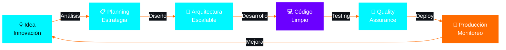

<div align="center">


</div>

<p align="center">
  
  
  
  
  
</p>

<br>

<div align="center">

```diff
@@                    🎯 MI MISIÓN                     @@
+  Crear software que impacte y soluciones que perduren  +
-         No solo escribo código, creo experiencias       -
!              Innovación + Calidad + Pasión              !
```

</div>


##  MI HISTORIA EN CÓDIGO


```javascript
class StivenJunior {
    constructor() {
        this.nombre = "Stiven / junior";
        this.rol = "Ingeniero en Informática";
        this.experiencia = "15+ años";
        this.ubicacion = "Neiva, Colombia 🇨🇴";
        this.pasion = "∞";
    }
    
    get habilidades() {
        return {
            lenguajes: ["JavaScript", "Python", "Java", 
                       "C++", "C#", "PHP", "Dart"],
            frameworks: ["Node.js", ".NET", "Flutter"],
            databases: ["MySQL", "Firebase", "SQLite"],
            tools: ["Docker", "Git", "Linux"],
            arquitectura: ["Microservicios", "APIs REST",
                          "Cloud Computing"]
        };
    }
    
    get experiencia() {
        return [
            "💻 Desarrollador Full Stack",
            "🏗️ Arquitecto de Software", 
            "👨‍💼 Tech Lead",
            "🚀 Cofundador & Emprendedor",
            "🎨 Freelancer Creativo"
        ];
    }
}

const yo = new StivenJunior();
console.log("🚀 Ready to build amazing things!");
```

<br clear="right"/>


##  ARSENAL TECNOLÓGICO

<div align="center">

<table>
<tr>
<td width="50%" valign="top">

### 🎨 Frontend Universe
<p align="center">
  
</p>

### ⚙️ Backend Powerhouse  
<p align="center">
  
</p>

### 💪 Core Languages
<p align="center">
  
</p>

</td>
<td width="50%" valign="top">

### 📱 Mobile & Apps
<p align="center">
  
</p>

### 💾 Databases
<p align="center">
  
</p>

### 🛠️ DevOps & Tools
<p align="center">
  
</p>

</td>
</tr>
</table>


</div>


##  CÓDIGO EN NÚMEROS

<div align="center">


<br><br>


</div>


##  PROYECTOS QUE CUENTAN HISTORIAS

<div align="center">

<table>
<tr>
<td width="50%" style="border: none;">

<div align="center">

<h3>📡 SMS Gateway</h3>
</div>

```yaml
Descripción: Sistema inteligente de mensajería
Stack: [API, Backend, Integración, Async]
Estado: ✅ En producción
Impacto: Miles de mensajes diarios
```

<p align="center">
  <a href="https://github.com/unsimpledev/ProyectoSMSGateway">
    
  </a>
  
</p>

</td>
<td width="50%" style="border: none;">

<div align="center">

<h3>🔔 Notificaciones Android</h3>
</div>

```yaml
Descripción: Push notifications avanzadas
Stack: [Android, Firebase, Cloud Messaging]
Estado: ✅ En producción  
Impacto: Tiempo real para miles de usuarios
```

<p align="center">
  <a href="https://github.com/unsimpledev/ProyectoNotificaciones">
    
  </a>
  
</p>

</td>
</tr>

<tr>
<td width="50%" style="border: none;">

<div align="center">

<h3>🤖 ChatGPT App</h3>
</div>

```yaml
Descripción: Asistente IA conversacional
Stack: [OpenAI API, Frontend, UX Design]
Estado: ✅ En producción
Impacto: Experiencia de chat inteligente
```

<p align="center">
  <a href="https://github.com/unsimpledev/MiChatGPT">
    
  </a>
  
</p>

</td>
<td width="50%" style="border: none;">

<div align="center">

<h3>🌍 Traductor IA</h3>
</div>

```yaml
Descripción: Traducción multilenguaje con IA
Stack: [NLP, Machine Learning, REST API]
Estado: ✅ En producción
Impacto: Comunicación sin fronteras
```

<p align="center">
  <a href="https://github.com/unsimpledev/MiTraductor">
    
  </a>
  
</p>

</td>
</tr>
</table>

</div>


##  MI FILOSOFÍA DE DESARROLLO

<div align="center">




### 💭 *"No escribo código solo por escribir, creo soluciones que transforman realidades"*


</div>


##  CONECTEMOS

<div align="center">

 **¿Tienes un proyecto en mente?** 

### 📧 **unsimpledev@gmail.com**

<br>

<a href="https://linkedin.com/in/unsimpledev">
  
</a>
<a href="https://fb.com/unsimpledev">
  
</a>
<a href="mailto:unsimpledev@gmail.com">
  
</a>

<br><br>


<br>


</div>

<div align="center">

### 🌟 Hecho con 💙 por Stiven Junior | unsimpledev 🌟
**"El código es arte, la solución es la obra maestra"**

</div>


